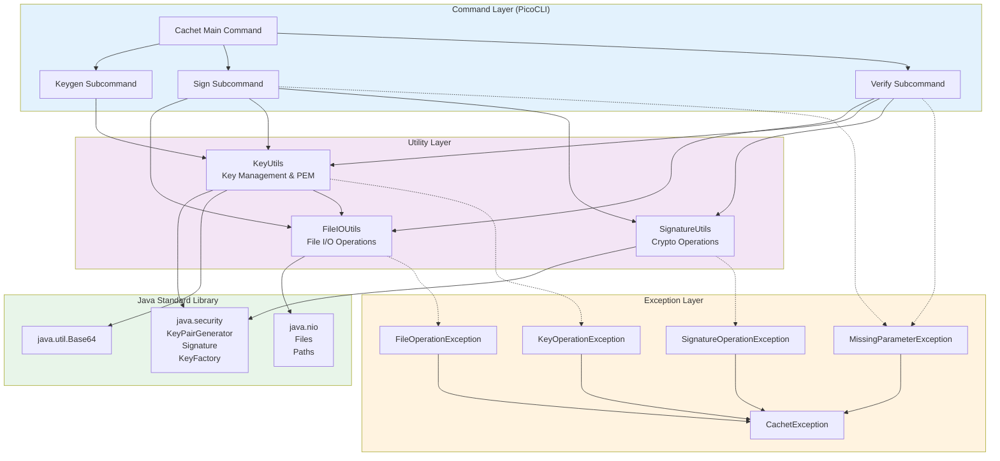

Table des matières
===

- Fonctionnalités
- Structure du projet 
- Composants
- Détails d'implémentation
- Suite / idées d'améliorations
- Démo et questions

<!-- end_slide -->

Fonctionnalités
===

### Génération de clés Ed25519: `cachet keygen`

Génération simple de paires de clés

### Signature de fichiers: `cachet sign`

Signature avec clé privée

### Validation de signature: `cachet verify`

Vérification avec clé publique

<!-- end_slide -->

Structure du projet
===

```
src/
└── main/
    └── java/
        └── ch.heigvd/
            ├── commands/
            │   ├── Cachet
            │   ├── Keygen
            │   ├── Sign
            │   └── Verify
            ├── exceptions/
            ├── utils/
            │   ├── FileIOUtils
            │   ├── KeyUtils
            │   └── SignatureUtils
            ├── Constants
            └── Main
└── test/
```

<!-- end_slide -->

Composants
===



<!-- end_slide -->

Détails d'implémentation
===

### Algorithme
- Courbe elliptique ED25519
- Défini dans `Constants.java`

### Format/encodage
- Clé privée PKCS#8 PEM
- Clé publique X.509 PEM
- Signature Base64

### Librairies
- `java.security` pour éviter les dépendances externes comme BouncyCastle

<!-- end_slide -->

Suite / idées d'améliorations
===

- Une commande pour compresser puis signer des répertoires de fichiers
*
- Capacité de keygen à dériver une clé publique
*
- Autres courbes elliptiques ?


<!-- end_slide -->
<!-- font_size: 3 -->
Démo
===
<!-- font_size: 1 -->

```bash +exec
java -jar cachet.jar keygen --private sk.pem --public pk.pem
```

<!-- end_slide -->
Clés Générées
===

```bash +exec
cat sk.pem # secret key
```

```bash +exec
cat pk.pem # public key
```

<!-- end_slide -->

Génération de Signature
===

```bash +exec
java -jar cachet.jar sign text.txt output.sig sk.pem
```
<!-- end_slide -->

Vérification de Signature
===

```bash +exec
java -jar cachet.jar verify text.txt output.sig pk.pem
```

<!-- end_slide -->

Corruption de la Signature
===

```bash +exec
# Remplace un byte aléatoire dans le fichier
SEEK=$((RANDOM % $(stat -f%z output.sig)))
dd if=/dev/urandom of=output.sig bs=1 count=1 seek=$SEEK conv=notrunc
```
<!-- end_slide -->

Vérification de Signature Invalide
===

```bash +exec
java -jar cachet.jar verify text.txt output.sig pk.pem
```

